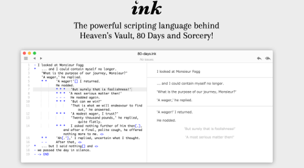
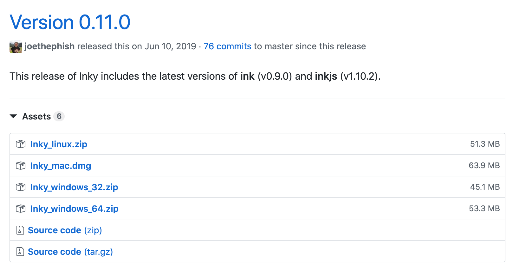
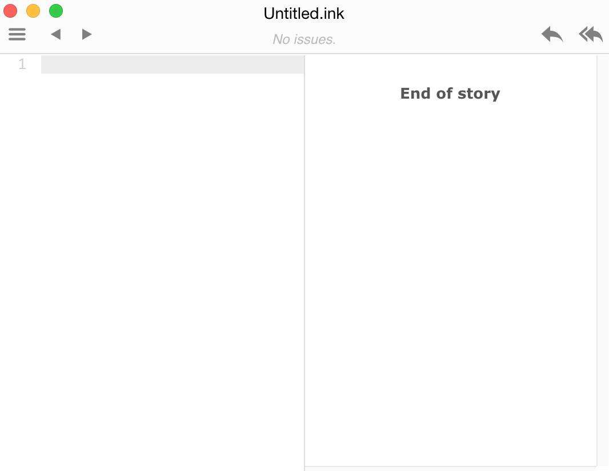
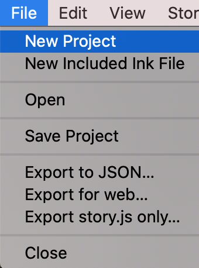
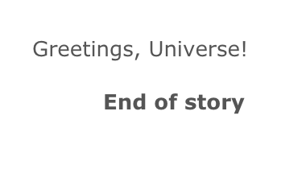

# Chapter 2: Ink and the Inky Editor

- [Chapter 2: Ink and the Inky Editor](#chapter-2-ink-and-the-inky-editor)
  - [Making Narrative Games](#making-narrative-games)
  - [Using Ink](#using-ink)
  - [Creating with Ink](#creating-with-ink)
  - [Inky Editor](#inky-editor)
    - [Windows](#windows)
    - [MacOS X](#macos-x)
  - [Using the Inky Editor](#using-the-inky-editor)
    - [Opening an Ink File](#opening-an-ink-file)
    - [Saving an Ink File](#saving-an-ink-file)
    - [Creating a New Project](#creating-a-new-project)
    - [Adding a New Included Ink File](#adding-a-new-included-ink-file)
    - [Working with an Inky Project](#working-with-an-inky-project)
      - [Rewind a Single Choice](#rewind-a-single-choice)
      - [Restart a Story](#restart-a-story)
  - [Try It](#try-it)

**Summary**: In this chapter, you will learn about Ink, where to find the Inky Editor, and generally how to install and use it through basics like opening, editing, and saving Ink file.

---

## Making Narrative Games

Ink is a "narrative scripting language" (ink, 2020). It was designed to create narrative game-like experiences through authoring different interactions. Ink is a *scripting language* created in order to help with the common problems of writing narrative games: giving the player choices, acting on those choices, and keeping track of information related to the game.

## Using Ink

Many projects use Ink as their narrative or dialog system. It helps writers construct a story that has multiple choices, paths, and outcomes for a player while other members of a team work with the finished product and interact with it through other tools like its Story API or the Unity Plugin. It is also a tool designed to produce a file that can be read by other tools. As part of a *toolchain*, a collection of tools where the output of one feeds another, it works well as something in which a writer or developer can write and test the story in one tool and then use its output as part of a graphical system or other tools.

## Creating with Ink

Ink is designed to produce text-based projects. Inky, the editor covered in this book, is focused on writing text-heavy projects. It works best with projects that have choices and outcomes, and has been designed around handling how to connect what a user sees with how they interact with the game.

That does not mean Ink has not been used in other, more graphical projects. *Heaven’s Vault* (2019), a game written in Ink and using the Unity game engine, was created by Inkle Studios, the inventor and maintainers of Ink. They integrated a story-rich game with animations, 3D models, and large worlds. Yet, its basis is in Ink itself, and their dialogue system, a central part of the game, is run directly from Ink.

## Inky Editor

Ink can be written in anything that can handle text. Some authors prefer to work in their favorite text editor and only move to another tool when it is time to create a compiled, final product. The choice, as always, is up to individual authors. However, the Inky Editor has something most other text editing programs do not: the Preview pane.

When writing Ink using the Inky Editor, the code will be previewed on the right-hand side. Every time there is a stop in writing, the code preview will be updated and the compiled product shown to the user. This helps in not only seeing how the code will look when run, but the previewing area allows for rewinding through choices and restarting the story, providing a quick way to see how taking other paths through the story might also look to a player.
Installing Inky



*Figure 1:* The Inky Website

The Ink webpage has a link to the Inky editor. Scroll down the page and click on the “Download” button under the name Inky.



*Figure 2:* Inky Download Links

Builds exist for Windows, Mac, and Linux systems and can be found on the Releases page for the product on GitHub. (Always download the most-current build to get the newest features and bug fixes!)

### Windows

When downloaded in Windows, Ink will be in a ZIP file. Uncompress the ZIP file and look for the Ink.exe executable file. Running this will open the Inky Editor.

### MacOS X

For MacOS X users, Inky will be in a DMG file. These can be opened and the Inky application moved into the Applications directory. Run Inky from inside the Application directory or directly from the Launchpad.

## Using the Inky Editor



*Figure 3:* Inky Editor

When opened, the Inky Editor will show two main panes. The first, on the left, is where the code is written. As it is run in the editor, the results will be previewed on the right pane.

### Opening an Ink File

Existing Ink files can be opened through the File menu and going to File → Open. Any Ink files can be opened this way and will be loaded in the Editor with their code on the left and the previewed results of the code on the right.

### Saving an Ink File

A collection of Ink files is called a project. Even if a project only contains one file, it can still be saved through the File → Save Project menu option.

### Creating a New Project



*Figure 4:* Inky Editor

A new project can be created through going to File → New Project. This will open a new window of the Inky Editor.

By default, Inky will list all current Ink files in the same directory of a newly created and saved Ink project.

### Adding a New Included Ink File

To more directly add a new Ink file to an existing project, the File → New Included Ink File option can be used. It will prompt what to name the file and then add it to the project.

### Working with an Inky Project


*Figure 5:* Rewind and Restart

Above the Preview pane where the Ink story is being run are two buttons: Rewind a Single Choice and Restart a Story.

The Preview pane will always show the End of Story as well. This is the true ending and is added when an author does not explicitly add it.

#### Rewind a Single Choice

While a story is being run, the Inky editor remembers each choice. At any point, these choices can be rewound by a single group of choices to the last previous position in the story.

#### Restart a Story

Similar to the Rewind a Single Choice button, the Restart Story button rewinds a story back to the first set of choices.

## Try It

Let’s practice working with Ink files!

First, make sure you have downloaded the Inky Editor for your operating system.

Open the Inky Editor.

Copy or type the following in the left-hand code pane:

```ink
Greetings, Universe!
```

Over in the Preview pane, the results of the code will be shown.



*Figure 6:* Results Preview

Be default, the name of a new Ink project is "Untitled.ink".

Choose "Save Project" from the File menu. File → Save Project.

In the Save As filed, name this file `Chapter2.ink`, select a location to save the file, and then click the "Save" button.

The Inky Editor will update its name to the new file. The project is now called "Chapter2.ink".

Congratulations on creating a new file, adding code, and then saving it!
